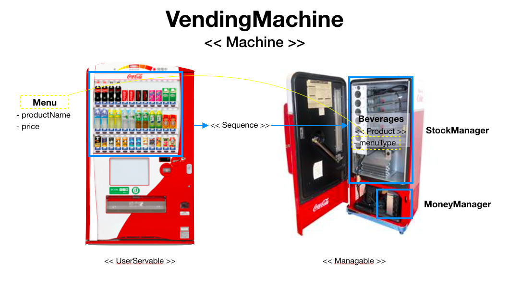
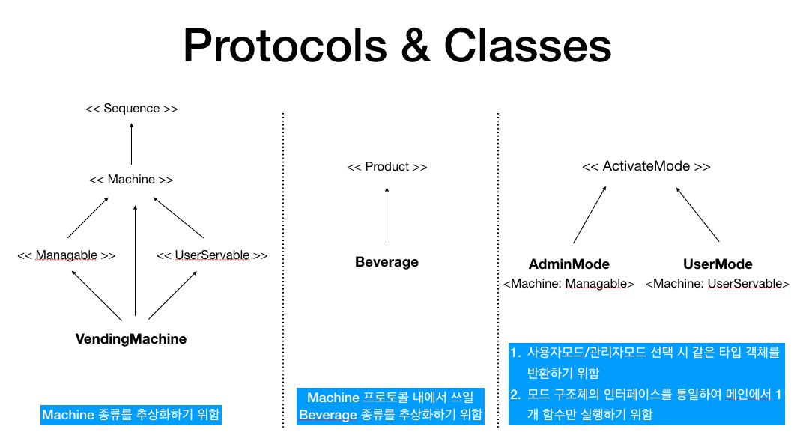
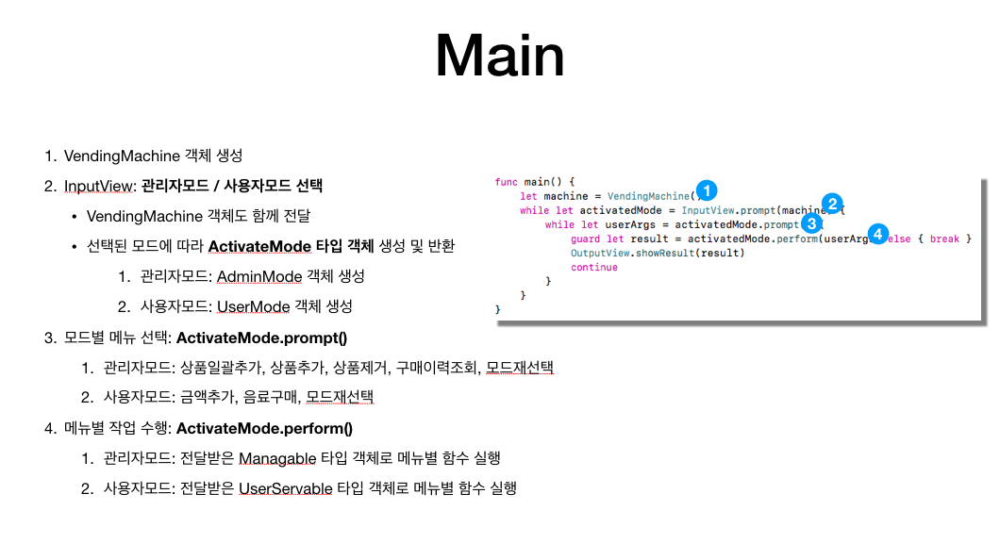
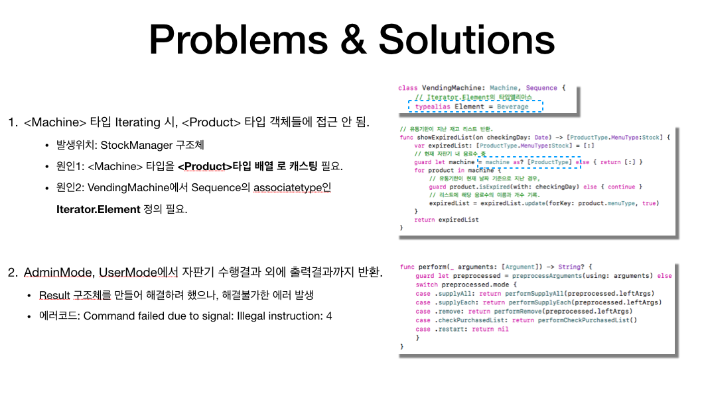

# 구조

## 깃헙 Issue/Project 탭 활용하기
- 프로젝트 > 마일스톤 > 이슈 순으로 작업단위 쪼개어 작은 단위단위에 집중할 수 있음. 각 작업단위에 발생하는 이슈사항 관리 가능. (문제점, 해결방법 등..)
- 깃헙 Issue, Project 탭 사용하기 —> 회사에서는 지라 등 프로젝트 매니지 툴 사용.
- 4시간 이하로 일감을 나누는 것이 적합.
- 1~2주에 한 번씩 스크럼으로 일감 진행을 검토하는 날이 있음.
- 하루종일 일감 쪼개는 일만 하는 날도 있음.

## Unit Test 란
> 코드의 특정 모듈이 의도된 대로 정확히 작동하는지 검증하는 절차로, 모든 함수와 메소드에 대한 테스트 케이스를 작성하는 절차

### 작성 시 주의사항
- 모든 테스트 케이스는 서로 분리되어야 함
- 전역변수를 만들어두고 setup(), tearDown()을 활용하는 것보다는 각 테스트 케이스 내에서 데이터를 따로 만들어 사용하는 편이 안전
- 가짜 객체(Mock object)를 생성하는 것도 좋은 방법
	- method 호출 유무 테스트 시: bool 보다는 count 를 통해 몇번 호출되는지를 확인
	- multiple assertiontest 시: 파라미터에 message, file name, line number 추가하여 에러메시지를 구체화
	- 배열이 같은지 확인할 시: 순서 유무는 상관 없으므로 contains 의 참거짓을 판별하는 코드로 교체. 
	- 에러메시지 더욱 구체화하기 위해 Swift Hamcrest matcher를 사용:
		- XCTAssertEqual ➔ XCTAssertTrue ➔ Swift Hamcrest matcher

**[출처] [위키피디아](https://ko.wikipedia.org/wiki/유닛_테스트), [TDD를 위한 mock 객체(fake object)만들기](https://medium.com/@bestofhandsomes/tdd를-위한-mock-객체-fake-object-만들기-ab008de7f1ab)**

## TDD(Test Driven Development) 란
> TDD = Test First Development + 리팩토링

> Test Fails ➔ Test Success ➔ Refactoring (반복)

### 작성 과정
1. 테스트 케이스부터 작성: 입력에 따른 출력만 확인
2. 역으로, 해당 함수 작성: **fail** 확인 후 빠르게 **pass** 하도록 리팩토링 (메소드명, 변수명 등)
3. 리팩토링: 리팩토링 메뉴, 함수형 프로그래밍 등 사용.
	- 리팩토링은 극단적으로 해야 좋음

### 장점
- 한 번에 한 가지에만 집중할 수 있다: 
    - 로직 구현에 집중
    - 테스트를 통과하기 위해 어떠한 행위도 허용
    - 테스트에서는 함수명 등에 관심가질 필요가 없다. 리팩토링을 통해 설계를 개선하면 되므로..
- 심적으로 안정감을 얻을 수 있다.
- 점점 테스트코드 작성하는 시간이 줄어들어, 삽질을 많이 할 수 있게 됨 -> 효율을 높일 수 있다.

### 발전
- 다른 활동에도 응용가능
    - 책쓰기: 현재 상태에서 쓸 수 있는 내용 위주로 빠르게 작성 -> 편집자에게 피드백 -> 퇴고
    - 창업 등...
    - 린스타트업과 비슷
- 정답이 없는 환경에서 돌파해나갈 때 필요한 자세: 삽질하고 피드백 받아 개선하는 사이클

 

**[출처] 제1회 마스터즈 세미나 - '나는 왜 TDD에 집착하는가(by.포비)' 중에서...**